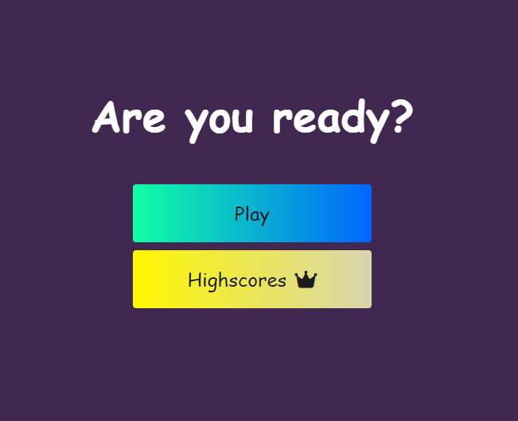

# Javascript Quiz
  
  ## ReadMe Description 

  This is a multiple choice Javascript Quiz! 
  ## Table of Contents: 

  * [Installation](#installation) 

  * [Contributors](#contributors) 

  * [Usage](#usage) 

  * [Tests](#tests) 

  * [License](#license) 

  ## Name: 

  Ryan Charleson
  ## Installation 

  None
  ## Contributors 

  Fork Repository
  ## Usage 

  Click the 'Play' button.
  Quiz will then start along with a countdown timer. 
  Your score will be tallied and recorded for future comparison.
  Have Fun! 
  ## Tests 

  None.

  ## Screenshots
  
  

  Email: jamescharleson@yahoo.com 

  Github: [ryancharleson](https://github.com/ryancharleson) 
